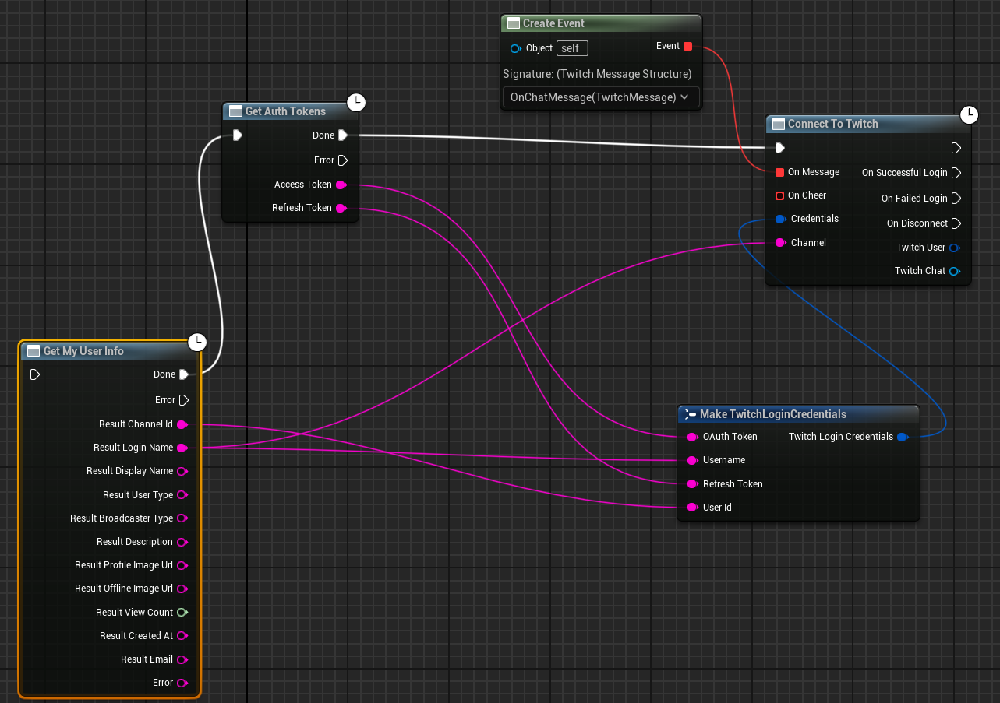
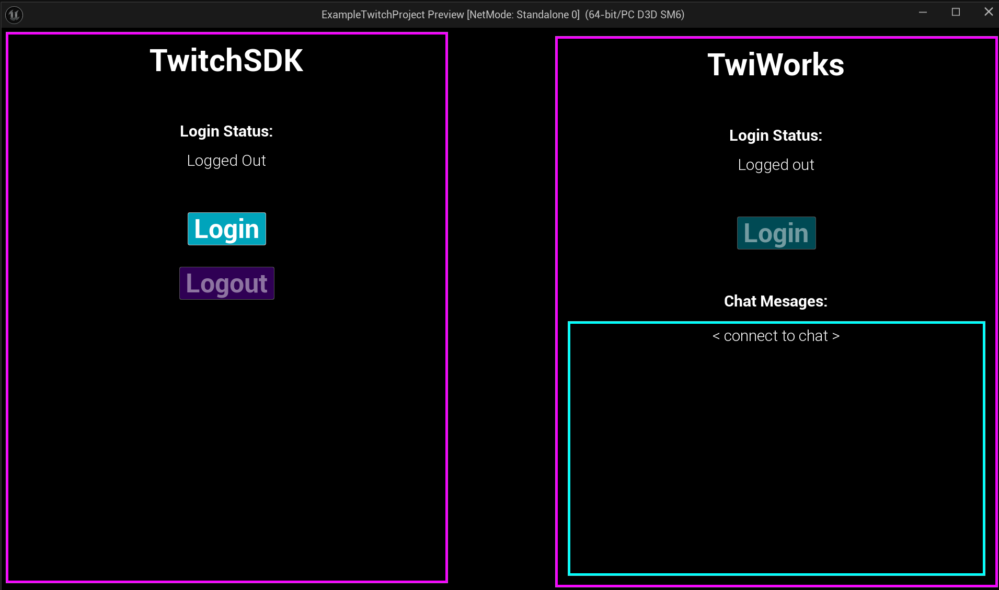

# Unreal Engine 5 TwitchSDK plugin integration for TwiWorks

> **Download**
>
> https://github.com/MrowrGames/UE5-TwitchSDK-TwiWorks-Integration/releases/tag/GetAuthTokens

This repo contains a patched `TwitchSDK` plugin and a **sample project** with the integration of the plugin with TwiWorks.

The `TwiWorks` plugin can be configured using existing Twitch auth (access token and refresh token).

This patch adds a `GetAuthTokens()` node to the `TwitchSDK` plugin, which returns the access token and refresh token.

This does **not** include the `TwiWorks` plugin. You can download it from the Unreal Marketplace. No changes are needed in the `TwiWorks` plugin.

---

Example project UI:

---

The TwitchSDK Unreal plugin is copyright Twitch.

Documentation:

- https://dev.twitch.tv/docs/game-engine-plugins/

Download link for latest SDK at the time of writing (121523):

- https://dev.twitch.tv/docs/assets/uploads/TwitchSDK-Unreal-121523.zip

Unreal Getting Started with Blueprints:

- https://dev.twitch.tv/docs/game-engine-plugins/unreal-guide-blueprints/

This code is NOT OPEN SOURCE. Please download it DIRECTLY from the Twitch website.

It is provided here for the patch to get TwithSDK working with TwiWorks.

---

> Patch commits (_the commits which add `GetAuthTokens` node for integration with TwiWorks_):
>
> Adds `GetUserTokens`:
> - https://github.com/MrowrGames/UE5-TwitchSDK-TwiWorks-Integration/commit/d9ee3c68e576a07580ccdf45334018b88d0c291a?w=1
>
> Renamed it to `GetAuthTokens`:
> - https://github.com/MrowrGames/UE5-TwitchSDK-TwiWorks-Integration/commit/45dd12dbd8da59059d6969ec4e396dafa45c0833?w=1
